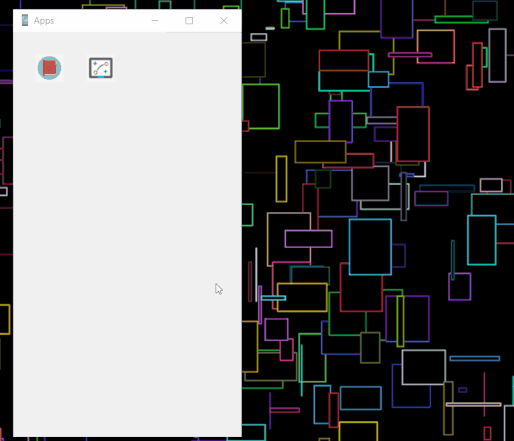
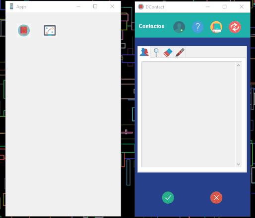
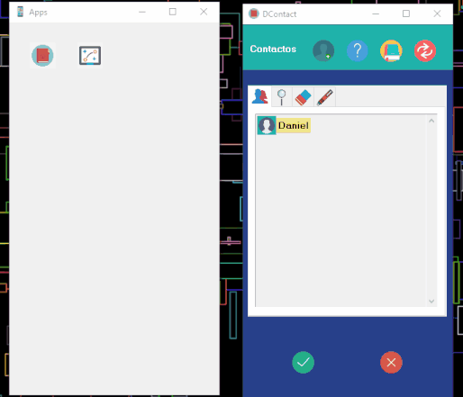

# Contact book
Is an little application made it in python in the introductiory course of the computer science career. It consist in a contact book application, where you can read, delete, update and add conatcts in the app. 

## Objectives of the project

## Functionalities

### Simple data validation

### Add person

### Help option

## Author
Danny Xie Li student in engineering in computer science
